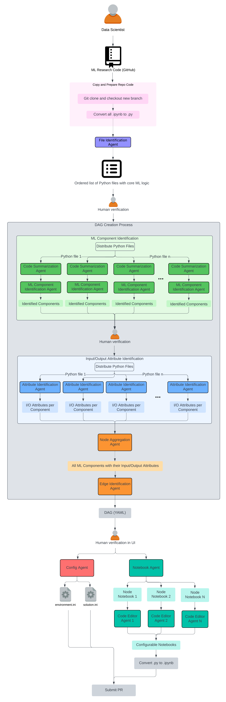

# ML Pipeline Agent

An AI-powered tool that automatically converts ML research code into production-ready DAG pipelines.

## Overview

ML Pipeline Agent helps data scientists transform their exploratory machine learning code into structured, production-grade workflows. Using a multi-agent architecture, it analyzes your Python/Jupyter notebooks, identifies ML components, and generates executable DAG pipelines.

## Architecture



## Key Features

- **Automatic File Analysis**: Identifies relevant ML code files from your repository
- **Component Detection**: Uses AI agents to identify ML components (data loading, preprocessing, training, evaluation, etc.)
- **DAG Generation**: Automatically creates workflow DAGs with proper dependencies
- **Human-in-the-Loop**: Built-in verification steps for quality control
- **Code Generation**: Produces production-ready notebooks and configuration files

## How It Works

1. **Repository Input**: Provide your ML research code repository (GitHub URL)
2. **File Identification**: The agent identifies Python files containing core ML logic
3. **Component Extraction**: AI agents analyze code to extract ML components and their I/O attributes
4. **DAG Creation**: Generates a DAG (YAML format) representing the ML workflow
5. **Code Generation**: Creates configurable notebooks and configuration files
6. **PR Submission**: Optionally submit the generated pipeline as a pull request

## Getting Started

### Prerequisites

- Python 3.12.6 or higher

### Installation

1. **Clone the Repository**
```bash
git clone https://github.com/yanfeid/ml-pipeline-agent.git
cd ml-pipeline-agent
```

2. **Create and Activate Virtual Environment**
```bash
python -m venv venv
source venv/bin/activate  # On Windows: venv\Scripts\activate
```

3. **Install Dependencies**
```bash
pip install -r requirements.txt
```

4. **Configure Environment Variables**
```bash
cp .env.example .env
```

Edit `.env` with your credentials:
- `GITHUB_USERNAME`: Your GitHub username
- `GITHUB_TOKEN`: GitHub personal access token
- `AZURE_CLIENT_ID`: Azure credentials (for LLM API access)
- `MODEL_NAME`: LLM model to use (default: `gpt-4o`)

### Running the Application

1. **Start the Backend API**
```bash
python run_api.py
```
The API runs at http://localhost:8000

2. **Start the Frontend UI**
```bash
python run_ui.py
```
The UI opens at http://localhost:8501

## Usage

1. Enter your ML repository's GitHub URL
2. Specify the Python files containing your ML pipeline logic (in execution order)
3. (Optional) Set a Run ID to organize experiments
4. (Optional) Resume from a previous checkpoint
5. Review and verify at each human-in-the-loop step
6. Export the generated DAG pipeline

## License

This project is patent-pending. Commercial use is prohibited.
